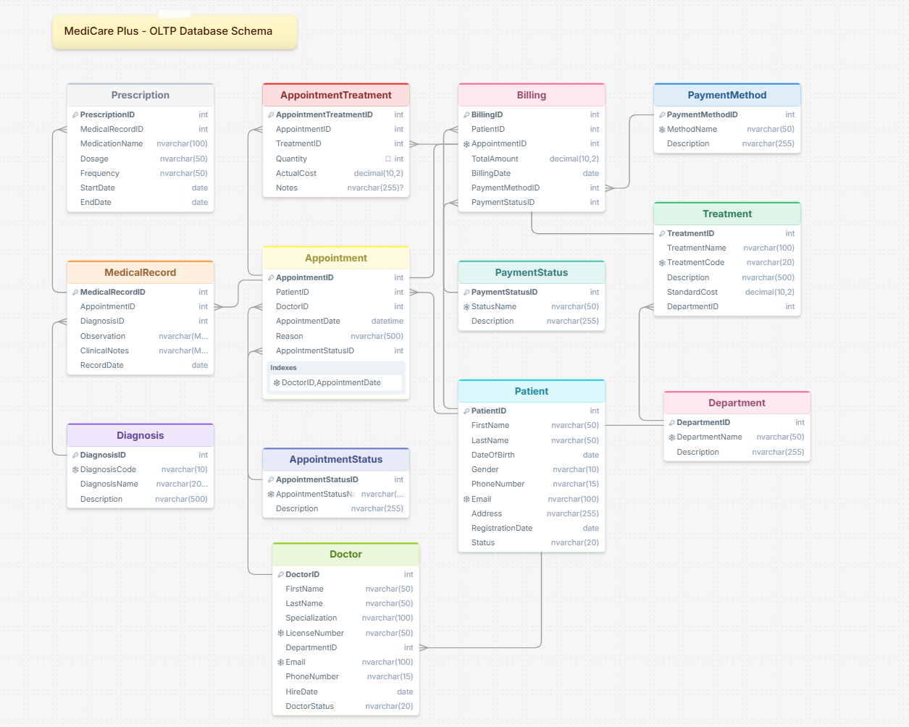
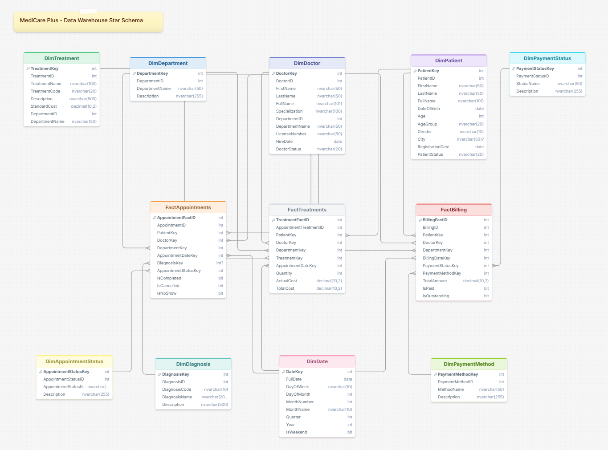
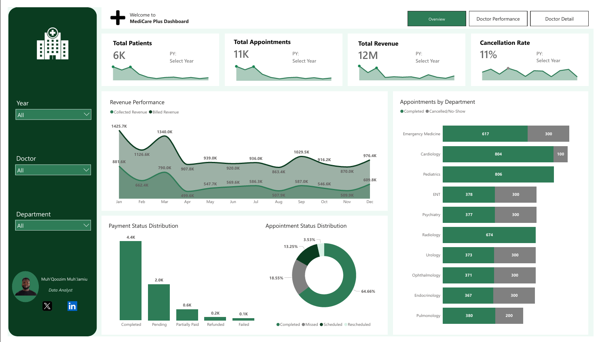
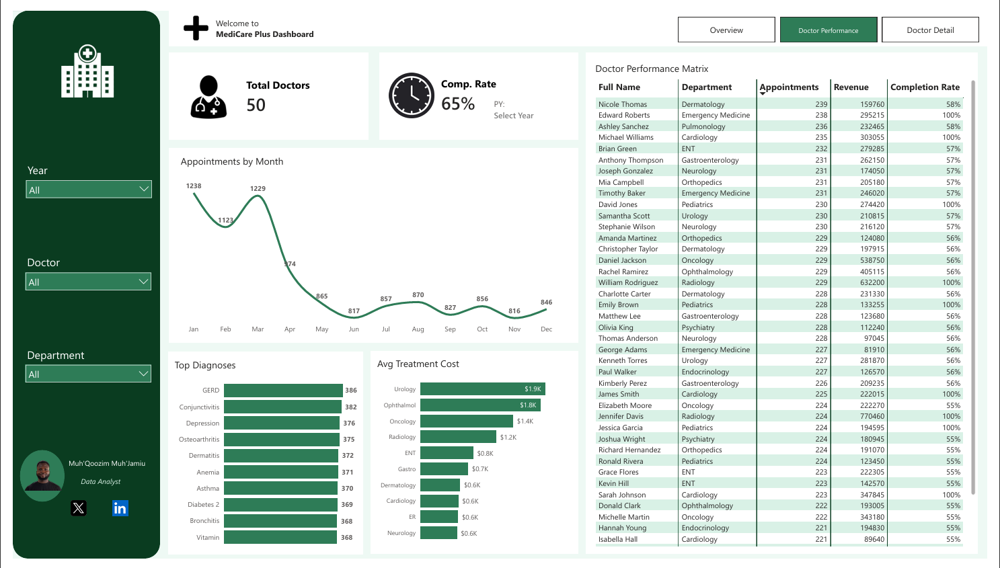
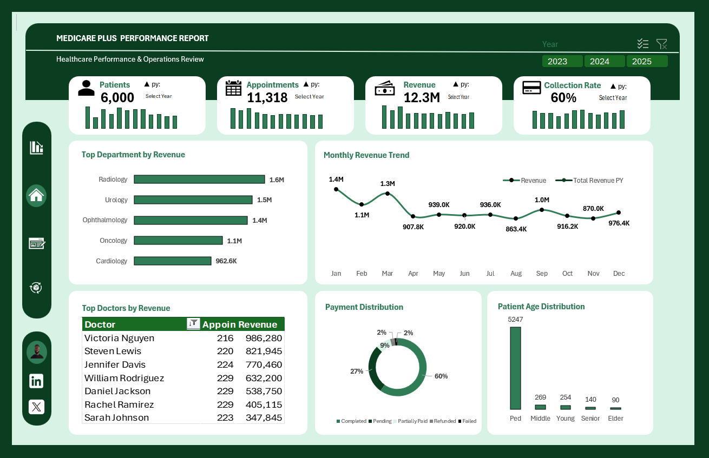

# MediCare Plus Healthcare Performance Analysis

### Revenue Leakage, Appointment Inefficiencies & Operational Performance Analysis in a Multi-Specialty Hospital

An end-to-end **Business Intelligence project** designed to uncover operational inefficiencies, revenue leakage, physician performance gaps, and patient demographic risks in a multi-specialty healthcare environment.

This project combines **SQL Server, Data Warehousing, ETL, Power BI, Excel, and Business Intelligence reporting** to transform raw healthcare operational data into actionable strategic insights.

---

## Table of Contents

- Project Overview
- Business Objectives
- About the Data
- Methodology
- Tools & Technologies
- Dashboard
- Key Insights
- Recommendations
- Full Analysis
- Conclusion

---

## Project Overview

Modern healthcare systems depend on delivering the right care, to the right patient, at the right time, while maintaining operational efficiency and financial sustainability.

MediCare Plus, a multi-specialty private healthcare provider operating across **15 clinical departments** with **50 physicians**, experienced growing concerns around:

- Revenue collection delays
- Appointment cancellations and no-shows
- Uneven physician performance
- Departmental inefficiencies
- Limited operational visibility

Despite generating over **$12.3M in billed revenue** between **2023 and 2025**, management observed growing inefficiencies in converting scheduled appointments into completed visits and billed revenue into collected cash.

This project was developed to identify:

- Where revenue leakage occurs
- Why appointments fail to convert
- Which physicians and departments drive performance
- What operational inefficiencies limit hospital effectiveness
- Which strategic actions could improve financial and operational outcomes

The project follows a complete **Business Intelligence lifecycle**, including:

- OLTP database development
- Data warehouse design
- ETL pipeline implementation
- SQL analysis
- Power BI dashboard development
- Excel executive reporting
- Strategic recommendation generation

---

## Business Objectives

The project sought to answer the following business questions:

### Revenue & Financial Performance
- How much billed revenue remains uncollected?
- Which departments generate the highest revenue?
- What factors contribute to revenue leakage?

### Appointment Efficiency
- What percentage of appointments result in completed visits?
- Which departments experience the highest cancellations and no-shows?

### Physician Performance
- Which doctors contribute most to hospital revenue?
- How does physician completion performance vary?

### Patient Demographics & Service Demand
- What does the patient demographic profile look like?
- Are there concentration risks in patient mix?

### Strategic Performance
- Which operational improvements would generate measurable financial impact?

---

## About the Data

The analysis was conducted using a structured healthcare dataset extracted from a normalized **SQL Server OLTP database** and transformed into a dimensional **Star Schema Data Warehouse** for analytical reporting.

### Dataset Summary

| Category | Volume |
|-----------|--------|
| Patients | 6,000 |
| Doctors | 50 |
| Departments | 15 |
| Appointments | 11,318 |
| Analysis Period | 2023 – 2025 |
| Total Revenue | $12.3M |

### Database Structure
### OLTP diagram

#### Reference Tables
- AppointmentStatus
- PaymentStatus
- PaymentMethod
- Diagnosis
- Department

#### Core Entity Tables
- Patient
- Doctor
- Treatment

#### Transactional Tables
- Appointment
- MedicalRecord
- Prescription
- AppointmentTreatment
- Billing

### Data Warehouse Design
### Data Warehouse Diagaram

The OLTP system was transformed into a **Star Schema Data Warehouse** comprising:

#### Fact Tables
- FactAppointments
- FactBilling
- FactTreatments

#### Dimension Tables
- DimPatient
- DimDoctor
- DimDepartment
- DimDate
- DimDiagnosis
- DimTreatment
- DimPaymentStatus
- DimPaymentMethod
- DimAppointmentStatus

This structure enabled efficient multidimensional analysis in **Power BI** and **Excel**.

---

## Methodology

### Phase 1: OLTP Database Design
Designed and implemented a normalized healthcare database in **Microsoft SQL Server** using **Third Normal Form (3NF)** to ensure relational integrity.

### Phase 2: Data Population
Generated a realistic synthetic healthcare dataset simulating:

- 6,000 patients
- 50 doctors
- 15 departments
- 11,000+ appointments

covering **2023–2025**.

### Phase 3: Data Warehouse Design & ETL
Built a **Star Schema Data Warehouse** using **T-SQL** and **Power Query**.

Transformation activities included:
- Data cleaning
- Standardization
- Derived attributes
- Validation checks
- Referential integrity enforcement

### Phase 4: SQL Analysis
Developed advanced SQL queries using:

- JOINS
- CTEs
- Window Functions
- Aggregations
- Ranking Functions
- Running Totals

to uncover operational and financial insights.

### Phase 5: Excel Reporting Model
Developed a structured **Excel Performance Dashboard** using:

- Power Pivot
- PivotTables
- PivotCharts
- KPI Cards
- Slicers
- Executive Reporting Layout

### Phase 6: Power BI Dashboard Development
Developed an interactive **3-page Power BI Dashboard** featuring:

- Executive Overview
- Doctor Performance Analysis
- Doctor Detail Drill-through

### Phase 7: Business Intelligence Interpretation
Translated findings into strategic business recommendations for:

- Revenue optimization
- Operational improvement
- Physician performance management
- Service diversification

---

## Tools & Technologies

| Tool | Purpose |
|------|---------|
| Microsoft SQL Server (T-SQL) | Database Design, ETL, Query Optimization |
| Power BI | Interactive Dashboard Development |
| DAX | KPI Measures & Calculations |
| Power Query | Data Cleaning & Transformation |
| Microsoft Excel / Power Pivot | Executive Reporting |
| SQL Server Security | Role-Based Access Control |
| Star Schema Modelling | Data Warehouse Architecture |
| Business Intelligence | Strategic Decision-Making |

---

## Dashboard

This project includes both an **interactive Power BI dashboard** and an **Excel executive reporting dashboard** for management reporting and decision-making.

---

## Power BI Dashboard

The Power BI solution was developed across **three analytical pages**.

### 1. Executive Overview Dashboard
Tracks:

- Total Revenue
- Collection Rate
- Appointment Completion Rate
- Appointment Status Distribution
- Department Performance
- Revenue Trends
    

### 2. Doctor Performance Dashboard
Tracks:

- Doctor Revenue Ranking
- Completion Rates
- Monthly Appointment Trends
- Diagnosis Distribution
- Treatment Cost Analysis

  

### 3. Doctor Detail (Drill-through)
Provides:

- Individual Physician Profile
- Monthly Revenue Trends
- Clinical Ledger
- Patient Demographics
- Diagnosis Mix
  
.png)

---

## Excel Executive Dashboard

The Excel dashboard was developed for:

- Executive reporting
- Offline analysis
- Printable performance packs
- Board-level performance reviews

### Dashboard Features

#### KPI Cards
- Total Patients
- Total Appointments
- Total Revenue
- Collection Rate

#### Analytical Visuals
- Revenue by Department
- Monthly Revenue Trend
- Payment Status Distribution
- Patient Age Distribution
- Top Doctors by Revenue

#### Interactive Features
- Year Filters (2023–2025)
- Department Slicers
- Year-on-Year Comparison

### Excel Dashboard Preview

---

## Key Insights

### Revenue Leakage

**40.4% of billed revenue remained uncollected**, representing **$4.19M** in unresolved receivables across **2,630 billing records**.

Of this:

- **$3.19M** remains fully outstanding across Pending and Insurance Pending categories
- **$1.0M** remains in Partially Paid status

This confirms a major revenue collection gap despite strong billing performance.

---

### Appointment Attrition

Only **64.7% of appointments resulted in completed visits**.

Of resolved appointments:

- **13.8% were cancelled**
- **8.5% were no-shows**

Meaning **more than one in five scheduled appointments generated zero clinical or financial output**.

Departments with the highest attrition included:

- Emergency Medicine
- ENT
- Psychiatry
- Urology
- Ophthalmology
- Endocrinology

Each recorded approximately **300 cancelled or missed appointments**.

---

### Physician Performance Gap

Completion rates ranged from **53.7% to 100%** across **50 physicians**.

- **29 physicians achieved perfect completion**
- **20 physicians recorded below 60%**

Top physician:

**Victoria Nguyen (Urology)**  
- Revenue: **$986,280**
- Completion Rate: **54%**

At higher efficiency, projected contribution could approach **$1.83M**.

---

### Revenue Concentration Risk

The **top 5 physicians generated 30.6% of hospital revenue** (**$3.77M of $12.3M**).

Top departments:

1. Radiology — **$1.6M**
2. Urology — **$1.5M**
3. Ophthalmology — **$1.4M**

Together accounting for **37% of total billed revenue**.

---

### Patient Demographics

**87.5% of patients were paediatric** (**5,247 of 6,000 patients**).

This creates a **7:1 concentration ratio** compared to adult patients and introduces long-term strategic dependency risk.

---

### Seasonal Demand Patterns

Appointment demand peaked in:

- January (**1,238 appointments**)
- March (**1,229 appointments**)

before falling to:

- June (**817 appointments**)

representing a **34% seasonal variance**.

---

## Recommendations

### 1. Strengthen Billing and Collections Process

Introduce:

- Automated payment reminders
- Dedicated billing ownership
- Structured payment plans

**Expected Impact:**  
Recover approximately **$1.9M in additional revenue**.

---

### 2. Reduce Appointment Cancellations and No-Shows 

Introduce:

- SMS reminders
- Email reminders
- Telephone confirmations
- Scheduling optimization

**Expected Impact:**  
Generate **700 additional completed appointments annually**, worth approximately **$1.17M**.

---

### 3. Expand High-Revenue Specialty Departments 

Expand:

- Urology
- Ophthalmology

through:

- Extended clinic hours
- Additional specialist sessions

**Expected Impact:**  
Generate **$250K+ annual revenue growth**.

---

### 4. Diversify Beyond Paediatric Care 

Target:

- Type 2 Diabetes
- Hypertension
- Osteoarthritis

through expanded adult healthcare outreach.

**Expected Impact:**  
Improved revenue diversification and reduced demographic concentration risk.

---

### 5. Establish a KPI Monitoring Framework 

Implement:

- Monthly KPI reviews
- Department accountability
- Dashboard-based monitoring
- Doctor performance reviews

**Expected Impact:**  
Faster issue identification and stronger execution of operational improvements.

---

## Combined Estimated Impact

### **≈ $3.3M in Revenue and Cash Flow Improvement**

---

## Full Analysis

Read the complete business analysis on Medium:

🔗 **Read Full Analysis Here**  
(https://medium.com/@qoozimjamiu21/medicare-plus-healthcare-performance-analysis-identifying-revenue-gaps-and-operational-03c224777931)

---

## Conclusion

MediCare Plus demonstrates strong patient demand and stable revenue generation but continues to face measurable inefficiencies in appointment conversion, billing collection, and physician utilization.

The analysis reveals that the hospital's greatest opportunities lie in **operational optimization rather than increased patient acquisition**.

By implementing the recommendations outlined in this project, MediCare Plus could potentially realize **approximately $3.3M in combined revenue and cash flow improvements**, while strengthening operational resilience, financial sustainability, and overall service quality.
